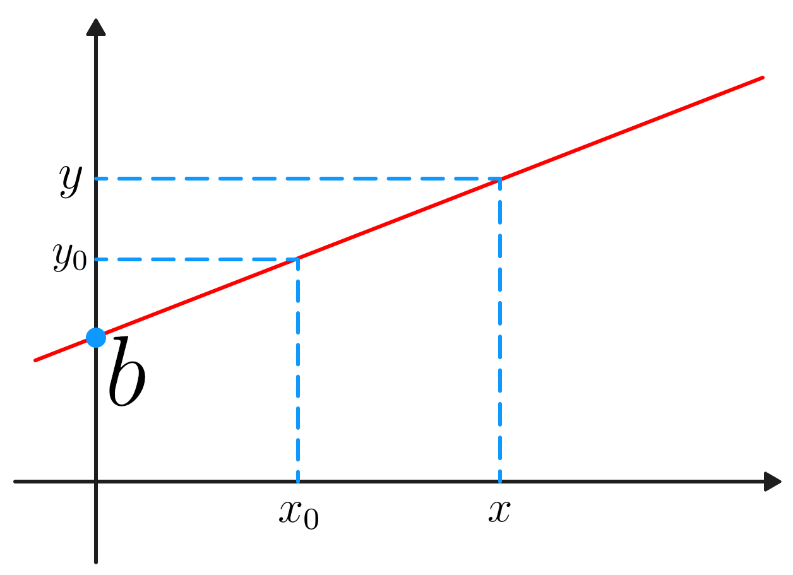
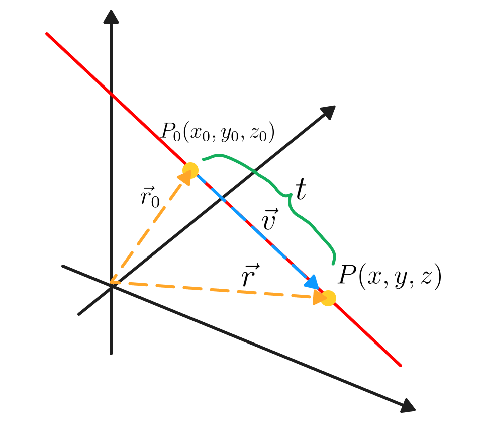
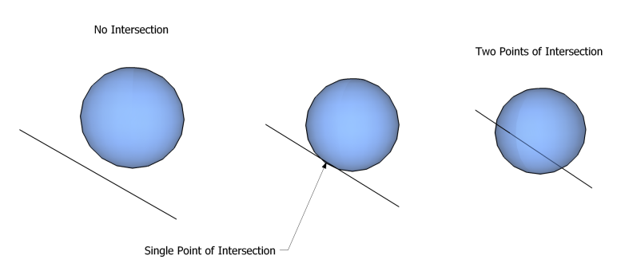

## ATENÇÃO: Explicação Teórica em Andamento

## Equação da Reta em $\mathbb{R}$ e $\mathbb{R}^3$

Podemos definir a equação de uma reta em $\mathbb{R}$ da seguinte maneira:

$$
y(x) = mx + b
$$

    <b>Equação 1</b>

onde $m, b \in \mathbb{R}$ e $y : \mathcal{D} \rightarrow \mathbb{R}$, sendo $\mathcal{D}$ o domínio de $y$. Podemos intuitivamente pensar em $b$ como a origem da reta no eixo-y e $m$ como sendo sua inclinação (Figura 1). 

    <b>Figura 1</b>

Isolando o termo $m$, obtemos:

$$
y - y_0 = m(x - x_0) \implies m = \frac{y - y_0}{x - x_0} = \frac{\Delta y}{\Delta x} 
$$

Ao expandirmos essa noção para 3 dimensões – isto é, sobre o domínio de $\mathbb{R}^3$ – podemos reescrever (Equação 1) da seguinte forma: 

$$
\mathbf{r}(t) = \mathbf{r}_0 + t\mathbf{v}
$$

    <b>Equação 2</b>

Onde $\mathbf{r}_0, \mathbf{v} \in \mathbb{R}^3$, $t \in \mathbb{R}$ e $\mathbf{r}: \mathcal{D} \rightarrow \mathbb{R}^3$.

A intuição para (Equação 2) pode ser facilmente visualizada: $\mathbf{r}_0$ é um vetor da origem (do espaço cartesiano) para um ponto $P_0$ na reta; $\mathbf{r}$ é um vetor da origem (do espaço cartesiano) para outro ponto qualquer $P$ na reta. Traçamos então um vetor $\mathbf{v}$, que vai de $P_0 \rightarrow P$. Este vetor é necessariamente paralelo à reta, porém nem sempre consegue alcançar $P$, por isso, devemos "aumentá-lo de tamanho", isto é, devemos multiplicá-lo por um escalar $t$ (Figura 2). 

    <b>Figura 2</b>

Utilizando esta equação, podemos representar qualquer reta sobre o domínio $\mathbb{R}^3$.
A explicação em vídeo pode ser encontrada em (Bazett, 2019) (YouTube).

---

## Equação Paramétrica de uma Esfera

Para representarmos uma esfera sobre o domínio $\mathbb{R}^3$, podemos fazê-la por meio de uma [equação paramétrica](https://en.wikipedia.org/wiki/Parametric_equation) (Wikipedia).

$$
x^2 + y^2 + z^2 = r^2
$$

    <b>Equação 3</b>

Para uma esfera centrada num ponto qualquer $P_0(x_0, y_0, z_0)$, podemos reescrever (Equação 3) da seguinte forma:

$$
(x - x_0)^2 + (y - y_0)^2 + (z - z_0)^2 = r^2
$$

    <b>Equação 4</b>

Onde $r \in \mathbb{R}$.
Na forma vetorial, (Equação 4) pode ser escrita como:

$$
|| \mathbf{r}(t) - \mathbf{c} ||^2 = r^2
$$

    <b>Equação 5</b>

Onde $\mathbf{r}: \mathcal{D} \rightarrow \mathbb{R}^3$ representa uma coleção de pontos na esféra e $\mathbf{c} \in \mathbb{R}^3$ representa o ponto central da esfera.

---

## Equação da Interceptação Reta-Esfera

Para encontrarmos os pontos que estão ambos na reta e na esfera, devemos combinar as 2 equações (Equação 2) e (Equação 5):

$$
|| \mathbf{r}_0 + t\mathbf{v} - \mathbf{c} ||^2 = r^2 \implies \left( \mathbf{r}_0 + t\mathbf{v} - \mathbf{c} \right) \cdot \left( \mathbf{r}_0 + t\mathbf{v} - \mathbf{c} \right) = r^2
$$

    <b>Equação 6</b>

Que pode ser reorganizada da seguinte maneira:

$$
t^2 \left( \mathbf{v} \cdot \mathbf{v} \right) + 2t\left[ \mathbf{v} \cdot \left( \mathbf{r}_0 - \mathbf{c} \right) \right] + \left( \mathbf{r}_0 - \mathbf{c} \right) \cdot \left( \mathbf{r}_0 - \mathbf{c} \right) - r^2 = 0
$$

    <b>Equação 7</b>

Isso revela uma característica sutil da equação, ela é uma equação quadrática e pode ser representada na forma $ax^2 + bx + c = 0$.

Seus coeficientes são, respectivamente:

$$
a = \mathbf{v} \cdot \mathbf{v} = || \mathbf{v} ||^2 \\
b = 2\left[ \mathbf{v} \cdot \left( \mathbf{r}_0 - \mathbf{c} \right) \right] \\
c = \left( \mathbf{r}_0 - \mathbf{c} \right) \cdot \left( \mathbf{r}_0 - \mathbf{c} \right) - r^2 = || \mathbf{r}_0 - \mathbf{c} ||^2 - r^2
$$

    <b>Equação 8</b>

Podemos, finalmente, encontrar as soluções desta equação por meio da seguinte expressão:

$$
t = \frac{-b \pm \sqrt{\Delta}}{2a}
$$

    <b>Equação 9</b>

Onde $\Delta = b^2 - 4ac$.

Ao analisarmos (Equação 9), vemos que $t$ representa a distância entre a origem e o ponto de interceptação. E é possível determinar se a reta intercepta a esfera ou não, e, também, em quantos pontos a faz.

- Se $\Delta < 0$, então é claro que não existem soluções, ou seja, a reta não intercepta a esfera (caso 1).
- Se $\Delta = 0$, então existe exatamente uma solução, ou seja, a reta toca a esfera em apenas um ponto (caso 2).
- Se $\Delta > 0$, existem duas soluções e, portanto, a reta toca a esfera em dois pontos (caso 3).

A derivação completa desta expressão pode ser encontrada em <a href="https://en.wikipedia.org/wiki/Line%E2%80%93sphere_intersection">Line–sphere intersection</a>(Wikipedia).

---

---

# Referências

SCRATCHAPIXEL. **Ray-Sphere Intersection**. Scratchapixel 4.0. Disponível em: <a href="https://www.scratchapixel.com/lessons/3d-basic-rendering/minimal-ray-tracer-rendering-simple-shapes/ray-sphere-intersection.html">link</a>. Acesso em: 27 jun. 2024.

Dr. Trefor Bazett, **The Vector Equation of Lines | Multivariable Calculus**. YouTube. Disponível em: <a href="https://youtu.be/iOeGgZIfryg">link</a>. Acesso em: 27 jun. 2024.
